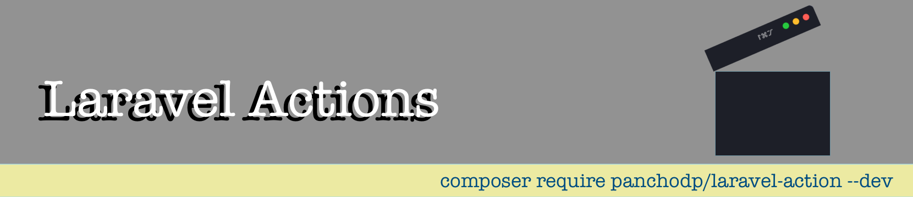

<p align="center"><a target="_blank"> </a></p>

<p align="center">
<a ></a>
<a ></a>
<a href="https://packagist.org/packages/panchodp/laravel-actions"></a>
<a href="https://packagist.org/packages/panchodp/laravel-actions"></a>
</p>


# Laravel Actions

Make your Laravel actions classes fast and in a simple way.

## Installation

You can install the package via composer:

```bash
composer require panchodp/laravel-actions --dev
```

## Configuration

Use the following command to publish the configuration file:
```bash
php artisan vendor:publish --provider="Panchodp\LaravelAction\LaravelActionServiceProvider" --tag="laravel-actions-config"
```
This will create a `config/laravel-actions.php` file in your application.

```php

return [
    'base_folder' => 'Actions',
    'method_name' => 'handle',
    'directory_permissions' => 0750,
];
```
There are two configuration options available: 
- `base_folder`: This is the base folder where your action classes will be created. By default, it is set to `Actions`, which means your action classes will be created in the `app/Actions` directory.
- `method_name`: This is the name of the method that will be created in your action classes. By default, it is set to `handle`, which means your action classes will have a `handle` method where you can implement your action logic.
- `directory_permissions`: This option defines the permissions for newly created actions folders This option defines the permissions for newly directories created by the package.
## Usage

1. To make an action class, you can use the `make:action` command:

```bash
php artisan make:action MyAction
```
This will create a new action class in the `app/Actions` directory with the name `MyAction.php`.

The class will have a `handle` method where you can implement your action logic.
```php
<?php

declare(strict_types=1);

namespace App\Actions;


use Throwable;

final class MyAction
{
         
    public static function handle(array $attributes): void
    {
        // This is where the action logic will be implemented.
    }
}
```


2. To make an action class in a specific subfolder of Action, you can use:

```bash
php artisan make:action MyAction Folder
```
This will create a new action class in the `app/Actions/Folder` directory with the name `MyAction.php`.

```php
<?php

declare(strict_types=1);

namespace App\Actions\Folder;


use Throwable;

final class MyAction
{
       
    public static function handle(array $attributes): void
    {
        // This is where the action logic will be implemented.
    }
}
```
Or you can use more than one subfolder like this:.

```bash

php artisan make:action MyAction Folder1/Folder2
```
This will create a new action class in the `app/Actions/Folder1/Folder2/` directory with the name `MyAction.php`.


### Flags
- `--t` This flag prepare the action class with Database trasactions.
For example, if you want to create an action class with transactions, you can use:

```bash
php artisan make:action MyAction --t
```
will result in the following action class:
```php
<?php

declare(strict_types=1);

namespace App\Actions;

use Illuminate\Support\Facades\DB;

use Throwable;

final class MyAction
{
            public static function handle(array $attributes): void
            {
                DB::transaction(function () use ($attributes) {
                  // Logic to be executed within the transaction
                });
    }
}
```

- `--u` This flag inyect User $user in the handle method.

For example, if you want to create an action class with User injection, you can use:

```bash
php artisan make:action MyAction --u
```
will result in the following action class:
```php
<?php

declare(strict_types=1);

namespace App\Actions;

use App\Models\User;
use Throwable;

final class MyAction
{
    public static function handle(User $user,array $attributes): void
    {
        // This is where the action logic will be implemented.
    }
}
```

- `--tu` or `--ut`  Use both flags together to prepare the action class with Database transactions and User injection.

```bash php artisan make:action MyAction --tu ``` or ```bash php artisan make:action MyAction --ut ```

will result in the following action class:

```php
<?php

declare(strict_types=1);

namespace App\Actions;

use Illuminate\Support\Facades\DB;
use App\Models\User;
use Throwable;

final class MyAction
{
            public static function handle(User $user,array $attributes): void
            {
                DB::transaction(function () use ($attributes) {
                  // Logic to be executed within the transaction
                });
    }
}

 
```

- `--r` This flag generates a Laravel Request class and injects it into the action method.

For example, if you want to create an action class with Request injection, you can use:

```bash
php artisan make:action MyAction --r
```
This will generate both an Action class and a Request class (`MyActionRequest`), and will result in:

```php
<?php

declare(strict_types=1);

namespace App\Actions;

use App\Http\Requests\MyActionRequest;

final class MyAction
{
    public static function handle(MyActionRequest $request): void
    {
        // This is where the action logic will be implemented.
    }
}
```

### Advanced Flag Combinations

You can combine multiple flags to create actions with different features. All possible combinations are supported:

**Two-flag combinations:**
- `--tr` or `--rt`: Database transactions with Request injection
- `--ur` or `--ru`: User injection with Request injection  
- `--tu` or `--ut`: Database transactions with User injection (as shown above)

**Three-flag combinations (all features):**
- `--tur`, `--tru`, `--utr`, `--urt`, `--rtu`, `--rut`: All features combined

For example:
```bash
php artisan make:action CompleteAction --tur
```

This will generate:
```php
<?php

declare(strict_types=1);

namespace App\Actions;

use Illuminate\Support\Facades\DB;
use App\Models\User;
use App\Http\Requests\CompleteActionRequest;

final class CompleteAction
{
    public static function handle(User $user, CompleteActionRequest $request): void
    {
        DB::transaction(function () use ($request) {
            // Logic to be executed within the transaction
        });
    }
}
```

**Individual flags are also supported:**
- `--t`: Only database transactions
- `--u`: Only user injection  
- `--r`: Only request injection


## Contributing

Pull requests are welcome. For major changes, please open an issue first
to discuss what you would like to change.

Please make sure to update tests as appropriate.

## License

[MIT](https://github.com/PanchoDP/laravel-actions/blob/master/LICENSE.md)