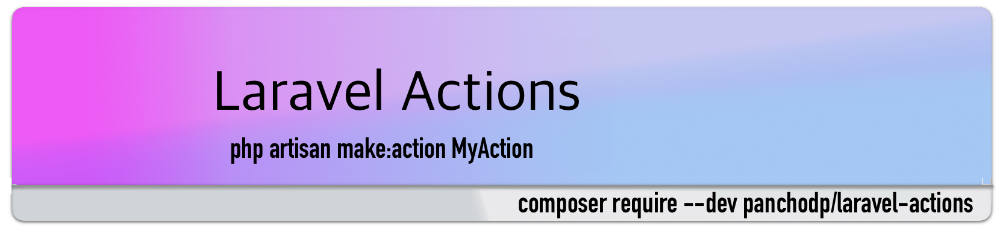

<p align="center"><a target="_blank"> </a></p>

<p align="center">
<a ></a>
<a ></a>
<a href="https://packagist.org/packages/panchodp/laravel-actions"></a>
<a href="https://packagist.org/packages/panchodp/laravel-actions"></a>
<a href="https://github.com/PanchoDP/laravel-actions/actions/workflows/tests.yml"></a>
</p>


# Laravel Actions

Make your Laravel actions classes fast and in a simple way.

## Compatibility

| Laravel | PHP    | Package |
|---------|--------|---------|
| 11.x    | 8.3+   | ^2.x    |
| 12.x    | 8.3+   | ^2.x    |
| 13.x    | 8.3+   | ^2.x    |

## Installation

You can install the package via composer:

```bash
composer require panchodp/laravel-actions --dev
```

## Configuration

Publish the configuration file:
```bash
php artisan vendor:publish --provider="Panchodp\LaravelAction\LaravelActionServiceProvider" --tag="laravel-actions-config"
```
This creates `config/laravel-actions.php`:

```php
return [
    'base_folder' => 'Actions',
    'method_name' => 'handle',
];
```

- `base_folder`: Base folder where action classes are created. Defaults to `Actions` (`app/Actions`).
- `method_name`: Method name generated in action classes. Defaults to `handle`.

## Customizing Stubs

You can publish and edit the stub templates used to generate action classes:

```bash
php artisan vendor:publish --provider="Panchodp\LaravelAction\LaravelActionServiceProvider" --tag="laravel-actions-stubs"
```

This publishes the 4 stubs to `resources/stubs/vendor/laravel-actions/`. Once published, the package will use your custom stubs instead of the defaults. You can customize each stub independently — any stub not found in your published directory will fall back to the package default.

## Method Types

By default, Laravel Actions generates **instance methods** for better flexibility and dependency injection support. However, you can create **static methods** when needed for simpler usage.

### Instance Methods (Default)
```php
// Usage
$action = new MyAction();
$action->handle($attributes);

// Generated code
public function handle(array $attributes): void
{
    // Implementation
}
```

### Static Methods
```php
// Usage
MyAction::handle($attributes);

// Generated code
public static function handle(array $attributes): void
{
    // Implementation
}
```

## Usage

### Interactive Mode

Run `make:action` without arguments to launch an interactive wizard:

```bash
php artisan make:action
```

```
 ┌ Action name ───────────────────────────────────────────────┐
 │ e.g. CreateUser                                            │
 └────────────────────────────────────────────────────────────┘
 ┌ Subfolder (optional) ──────────────────────────────────────┐
 │ e.g. User or User/Auth                                     │
 └────────────────────────────────────────────────────────────┘
 ┌ Include DB transaction? ───────────────────────────────────┐
 │ ● Yes / ○ No                                               │
 └────────────────────────────────────────────────────────────┘
 ...
```

### Creating Actions

To create an action class, use the `make:action` command. You can specify the full path using forward slashes `/` or backslashes `\` (Laravel-style syntax):

**Basic action:**
```bash
php artisan make:action MyAction
```
This creates a new action class in the `app/Actions` directory.

**Action in a subfolder:**
```bash
php artisan make:action User/CreateAccount
```
This creates the action in `app/Actions/User/CreateAccount.php`.

**Action in nested subfolders:**
```bash
php artisan make:action User/Auth/Login
```
This creates the action in `app/Actions/User/Auth/Login.php`.

**Using backslashes (alternative syntax):**
```bash
php artisan make:action Admin\DeletePost
```
This creates the action in `app/Actions/Admin/DeletePost.php`.

The generated class will have a `handle` method where you can implement your action logic:
```php
<?php

declare(strict_types=1);

namespace App\Actions\User;

use Throwable;

final class CreateAccount
{
    public function handle(array $attributes): void
    {
        // This is where the action logic will be implemented.
    }
}
```


### Flags

| Flag | Shortcut | Description |
|------|----------|-------------|
| `--transaction` | `-t` | Wraps the action body in a `DB::transaction` |
| `--user` | `-u` | Injects `User $user` into the method |
| `--request` | `-r` | Generates a `Request` class and injects it into the method |
| `--static` | `-s` | Generates a `static` method instead of an instance method |
| `--force` | | Overwrites the action if it already exists |

Shortcuts can be combined in any order, just like `make:model`:

```bash
php artisan make:action MyAction -tur    # transaction + user + request
php artisan make:action MyAction -turs   # + static method

# Long form works too
php artisan make:action MyAction --transaction --user --request
```

Example output for `--turs`:

```php
final class MyAction
{
    public static function handle(User $user, MyActionRequest $request): void
    {
        DB::transaction(function () use ($request) {
            // Logic to be executed within the transaction
        });
    }
}
```

## Other Userfull Commands:

You can show the Actions directory tree in the terminal with the following command:

```bash
php artisan actions:list
```
This will display the structure of the `app/Actions` or the base directory specified in the config file, showing all action classes and their subdirectories.

```bash
Actions/
├── Folder1/
│   ├── SecondAction
│   └── ThirdAction
├── Folder2/
│   └── FourthAction
├── FirstAction
└── LastAction
```


## Contributing

Pull requests are welcome. For major changes, please open an issue first
to discuss what you would like to change.

Please make sure to update tests as appropriate.

## License

[MIT](https://github.com/PanchoDP/laravel-actions/blob/master/LICENSE.md)